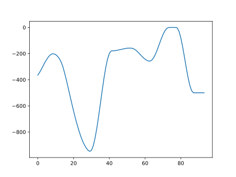

# UTAU Pitch字符串解码

## 简要声明
你好，初次见面，我是狼大。

这篇文章是基于tn_fnds的源代码分析而得的，会存在大量不严谨和过度简化的部分。  
你可以在[这里](https://github.com/ohac/tn_fnds)找到源代码。

特别鸣谢 [Serix](https://github.com/serix2004) 对于源代码的解读。

- [UTAU Pitch字符串解码](#utau-pitch字符串解码)
  - [简要声明](#简要声明)
  - [解码](#解码)
    - [Pitch字符串是什么](#pitch字符串是什么)
    - [分割Pitch字符串](#分割pitch字符串)
    - [Get64函数](#get64函数)
    - [解码](#解码-1)
  - [尾声](#尾声)
  

## 解码
### Pitch字符串是什么
对于UTAU传到resampler的参数里面，有一条就是Pitch字符串。

` @"%resamp%"%1 %temp% %2 %vel% %flag% %5 %6 %7 %8 %params% `
> 启动重采样引擎

`%params%` 里面有

`@set params=100 0 !120 AA#5#`

`AA#5#` 就是Pitch字符串  

### 分割Pitch字符串  
知道Pitch字符串是什么了，现在开始进行一些简单的处理。

`6T6o7B7b718M8g8u82828w8k8S757U6j5s4x31262B1K0YzqzAycx/xnxVxMxTx2ywz81X254d577O8O859M9N9O9Q9T9W9Z9c9f9h9i9i9g9a9Q9D818m8Y8N8E7/7/8J8d869c+C+n/J/k/3//AA#14#/8/h+v9s8e7O6D5G4d4M#18#`

（是的我知道这个很长）  

我们先以`#`字符为分割线进行分割。  
+ `T6o7B7b718M8g8u82828w8k8S757U6j5s4x31262B1K0YzqzAycx/xnxVxMxTx2ywz81X254d577O8O859M9N9O9Q9T9W9Z9c9f9h9i9i9g9a9Q9D818m8Y8N8E7/7/8J8d869c+C+n/J/k/3//AA`
+ `#14#`
+ `/8/h+v9s8e7O6D5G4d4M`
+ `#18#`

然后，对于每一段不是`#数字#`格式的，每两个为一组.  
比如：

`/8` `/h` `+v` `9s` `8e` `7O` `6D` `5G` `4d` `4M`

对于刚刚的`#数字#`格式，对对应的Pitch字符串根据数字重复最后一组字符。  
比如：
+ `/8` `/h` `+v` `9s` `8e` `7O` `6D` `5G` `4d` `4M` `#18#`

变成

+ `/8` `/h` `+v` `9s` `8e` `7O` `6D` `5G` `4d` `4M` `4M` `4M` `4M` `4M` `4M` `4M` `4M` `4M` `4M` `4M` `4M` `4M` `4M` `4M` `4M` `4M` `4M` `4M`

（合计19个`4M`）

### Get64函数
在tn_fnds里面有一个函数叫做get64( )  
（注：这段代码是从飴屋／菖蒲的world4utau.cpp移植的）

简而言之，
+ 对于A～Z的字符，返回0~25的值
+ 对于a～z的字符，返回26~51的值
+ 对于0～9的字符，返回52~61的值
+ 对于 + 字符，返回62
+ 对于 / 字符，返回63

### 解码
对于刚刚分割好的每一组两个字符(char x, char y)  
进行`get64(x)*64 + get64(y)`  
如果结果大于2047，减去4096就可以得到正确的值，  
也就是说，Pitch数值应介于-2048~2047。  

返回的值就是解码过后的Pitch数值。

比如`/8`：
+ `get64(/) -> 63`
+ `get64(8) -> 60`
  
所以Pitch数值为 `63*64 + 60 - 4096 = -4`  

我写了一个简单的Python脚本，用`matplotlib`得到的结果：  

## 尾声
不过对于Pitch数值的单位，如何转换成偏移的频率还没有研究。  
如果有想法，可以对我的文档进行补充！  
   
以上就是基本的解码啦，希望有学到一些！  
  
再次感谢 Serix 对于源代码的解读！  
