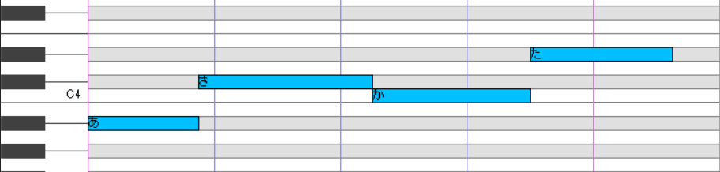
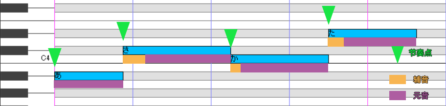
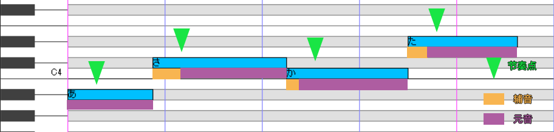
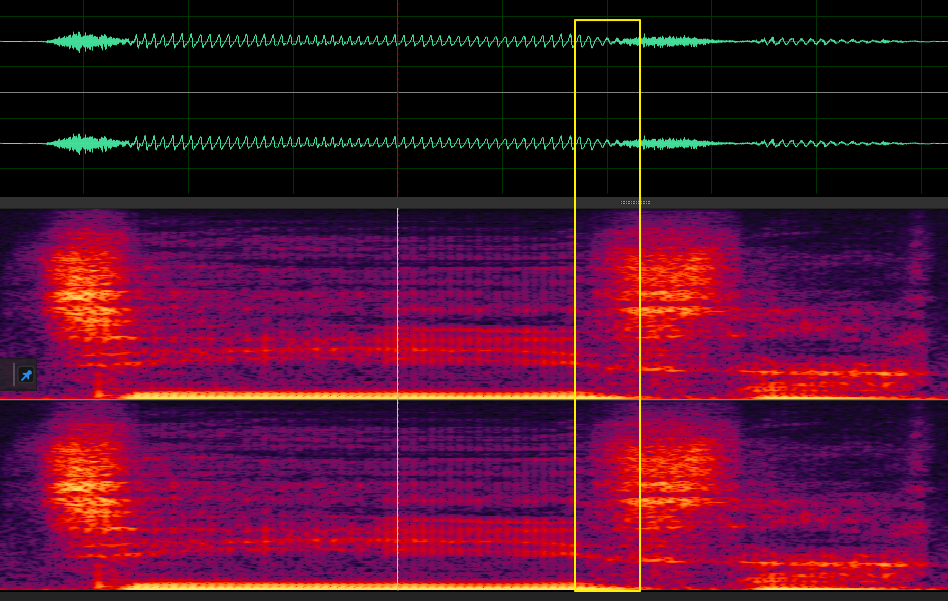
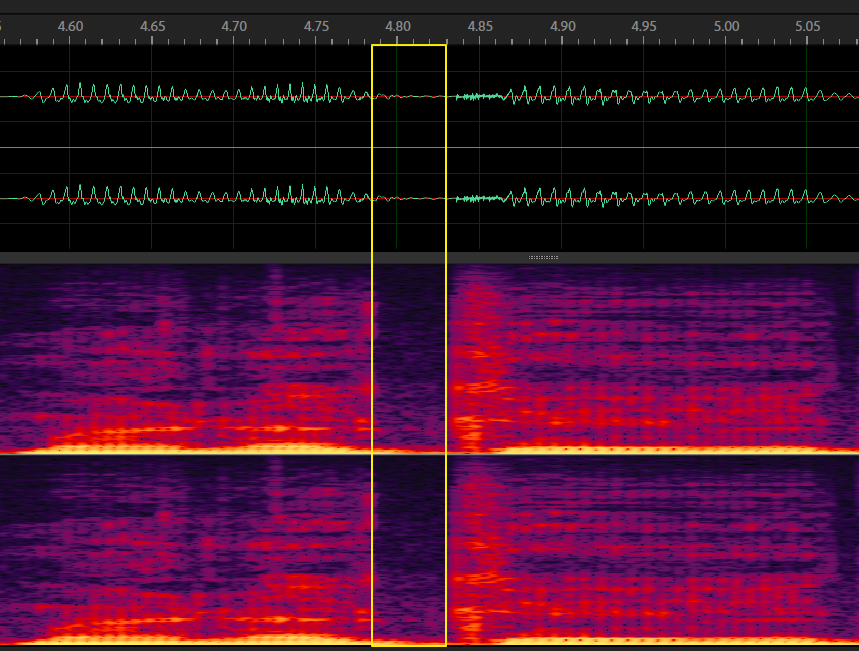
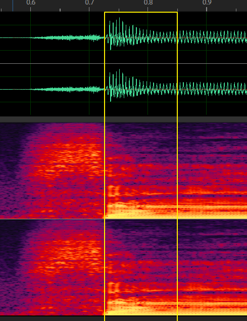
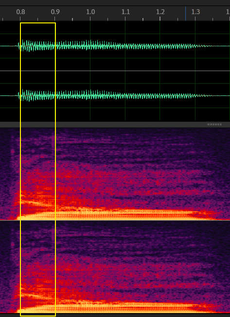

# 闪闪的原音设定碎碎念1

作者：[shine\_5402](https://github.com/shine5402)

## 一条原音设定条目里到底包含了什么

今天来讨论一下↑这个问题好了。

那我们先来看一条原音设定项目（就是oto.ini里的一条数据）：

可以看到，一条原音设定包含了：

- Left Blank（左边界）：指的是这个原音块的起始在WAV原音的哪个位置

- Overlap（重叠）：指的是后面音符的辅音部分和前面音符的结尾部分的重叠长度，两者将同时发声

- Pre-utterance（先行发声）：指的是该原音块提前于音符发声的部分何时结束。通常处于辅音的结束部分。

- Consonant（固定[^consonant]）：指的是该原音块拉伸/循环区的起始位置，或者说固定不拉伸区域的结束位置。在左边界和它之间的部分不会被拉伸，不过可以通过指定辅音速度来拉伸/收缩这一区域。

[^consonant]:虽然此处consonant应当被翻译为辅音，UTAU软件中也是这么叫的，但是因为实际上它的作用是确定固定范围，称其为辅音可能会造成之后的讨论中产生混淆，于是我便直接称其为固定。至于为何UTAU要把它叫做辅音，我猜是和把拉伸区叫做“元音”这一行为相对的关系。

- Right Blank（右边界）：指的是是这个原音块的结束在WAV原音的哪个位置

- Alias（辅助记号/别名）：这个原音块在歌词区域（就是音符里输入的东西）应使用什么歌词进行调用。叫做别名是因为它代替了WAV的文件名（在没有别名时）作为歌词被识别的职责。

而在oto.ini文件中，原音设定数据的格式是

    [文件名].wav=别名,左边界,固定,右边界,先行发声,重叠

然后让我们先来明晰一个概念：**UTAU的原音设定是基于单独音（一个音节）[^韵尾问题]设计的。** 事实上，连续音这一概念也是在UTAU出现之后过一段时间的事情了[^连续音历史]。因此，原音设定的各项数据的定义应该都是跟着单独音的思路来的。而连续音和CVVC等带有连续性的方案则是因为这套原音设定机制虽然是按照单独音的思路设计，但也能为带有连续性的方案提供支持，详见之后关于 *连续音和CVVC* 的讨论。

[^韵尾问题]:事实上UTAU的原音设定条目也没有考虑到韵尾、音节尾等音末不拉伸音素的存在，所以音节中有音末不拉伸音素的语言（如中文）即使使用单独音方案，也需要单独拆分韵尾/音节末音素。在新版本的开发计划中，考虑到音末不拉伸音素的“后固定区域”已经有了支持计划，且新放出的本家引擎已经拥有了相关支持。

[^连续音历史]:如果要展开来讲连续音出现的契机、历史和贡献者，那估计能再开一篇碎碎念……所以这里不去展开（这方面我也不算很了解），感兴趣的可以自己去了解一下（？）

那，在得知上述概念之后，我们再来看看原音设定的各项条目：

#### 左边界和右边界

这没什么可说的，就是调用的原音块的开始和结束……

#### 先行发声

先行发声就有比较多的说头了。

在讨论为什么要设计先行发声这个概念之前，我们先讨论一个前置条件：**人类对节奏点的判断是基于*辅音结束、元音开始*的地方（或者说*音节核的起始*）。**

首先我们可以直观的感受一下这个问题。对自己节奏感比较有自信的同学可以唱一首歌，然后打拍子（或者可以开节拍器），你可以直接感受，或者录下来之后再在软件里观察。你会发现自己的拍子都是打在元音的起始点的地方：

当然，如果觉得自己节奏感不太好的同学，可以直接打开一首歌的贴混工程对对轨，你会发现，将鼓点对齐到元音起始点才会带来对好了轨的感觉。（如果原曲不是很母带到砖块，或者有伴奏比较不吵，可以看清鼓点和人声的部分，也可以用原曲和配布的伴奏进行比对）。

经过这些体验，估计对于这个概念大家应该也清楚了。实际上也有相关论文讨论过这个问题，参见：【Allen, George D . The Location of Rhythmic Stress Beats in English: an Experimental Study I[J]. Language & Speech, 1972, 15(1):72-100.】虽然这篇论文是讨论英语对话中的节奏问题，但是对于“节奏点位于辅音结束母音起始”这个概念提供了具体科学的实验证据。

那就让我们来正式谈谈先行发声。先行发声的意思就是：**该原音块提前于音符发声的部分**。也就是说，对于这个音符，从左边界到先行发声的部分并不在这个音符的范围内，而是占用前一个音符的位置。先行发声通常位于辅音的结束位置。我们可以从UTAU的“显示音高曲线”模式看到：

红框内就是提前于该音符的部分。

那么为什么要这么设计呢？这就和之前讨论到的节奏点问题有关了。
我们先来随便画几个音符：

然后，我们知道，节奏点肯定是要和音符对齐的，所以我们在音符的起始处画几个标记，作为节奏点参照：

然后我们再引入两个事实：一，很显然的，**不同的辅音长度不同**，而辅音的长度和音符的长度并不是正相关，也就是说并不是音符的长度变长，辅音就必须变长；二、唱歌时占据音符绝大部分位置的是元音，且元音的长度和音符的长度成正相关，也就是音符的长度的变化会导致元音长度的变化，也就是说**程序需要去计算需要合成的元音的长度**，而辅音的长度会影响元音的长度。嘛，说的简洁一点就是元音长度是应变量，辅音长度和音符长度是自变量。

然后，我们先假定没有先行发声这一概念，也就是辅音本身位于当前音符内，也就是音符的起始位置和辅音的位置一致。我们根据这一条件模拟一下程序计算出的元辅音长度（瞎划拉的，不是很严谨）：

接下来，因为我们上面讨论的“人类对节奏点的判断是基于*辅音结束、元音开始*的地方”的原因，我们来移动一下这个音轨，让其第二个辅音对齐节奏点：

问题出现了。我们可以看到除了第二个辅音之外，其他的辅音结束点都没有和节奏点对齐。这是因为每种辅音的长度并不完全一致，如果将其时长放入音符本身，那么就会导致其结束点之间的间隔变成了“音符长度-辅音长度”，那么就会和节奏点要求的“音符长度”不同，从而导致偏移。

所以先行发声就是为了解决这个问题。接下来我们图中的辅音都移动至前面的音符：

可以看到，将辅音放置在音符的前面就可以解决上述的辅音结束点间隔和节奏点要求不同的问题了。

参见：【Berndtsson G . The KTH Rule System for Singing Synthesis[J]. Computer Music Journal, 1996, 20(1):76-91.】涉及到这方面的讨论。

#### 重叠

我们先来随便唱一段歌，然后打开看看其中两个字：

我们可以看到，部分种类的辅音和元音之间其实有着重叠部分。所以原音设定中的“重叠”的设计就是为了模拟这种重叠。我们可以从这张图中看到在“显示音高曲线”模式下原音设定各数值的位置：

重叠也可以是负数。在这种情况下，重叠会在辅音前创造一个小小的空白区域：

（很偷懒，直接复制了之前的图例）

这种机制允许你模拟塞音和塞擦音前的短暂空白[^模拟空白的其他办法]：

[^模拟空白的其他办法]:其实也可以通过移动左包入部分空白，Ovl设为0或者保证Ovl之后有一定空白区域的方式来模拟这种空白，两种方法的利弊倒是见仁见智。

#### 固定[^consonant]

轮到固定这个数值了。

上文也提到过，辅音本身是不属于拉伸范围的，一般情况下辅音并不会被UTAU拉伸（除非你手动指定辅音速度要求它被拉伸）。

不过不属于拉伸范围的也不止是单纯的辅音。首先，辅音过渡到稳定的元音也会有一小段部分，这一部分你肯定不会想程序去拉伸。

另一个问题则是韵头，比如各种语言中的双元音。如中文中的bie，你唱歌的时候拉长的应当是其中的ie的e（e0）那部分，i你肯定不会因为音符越长而唱的越长。所以这一部分也应当属于不被拉伸的范围。

（为了看得清楚一点，其实这里念的是biao）

这就是“固定”机制的作用，只要将这些在音开头不希望被拉伸的部分包进去，UTAU就不会去拉伸他们（除非指定辅音速度）。如果你的音符最后计算出的元音长度短于固定区域，那么UTAU会直接对固定区域进行裁剪，放弃后面的拉伸区域[^中文快歌下韵头]。

[^中文快歌下韵头]:因此，中文快歌下可能需要用辅音速度手动控制一下韵头长度。

一般说来，只要保证固定和右边界之间是一段稳定的元音区域就好。

#### 别名

别名也没啥可说的……单纯就是歌词区域要输入什么东西来调用这个块而已。

### 结束

那今天姑且就先讲到这里吧。

以下是致谢：

十分感谢farter聚聚解答了我关于对原音块的称呼和先行发声概念解释的疑问；十分感谢铃伊桑和我就先行发声的概念的讨论；十分感谢哈鲁的UTAU入门教程，我的命是哈鲁给的（啊？）；也十分感谢哈鲁鲁的UTAU群的大家。

那么之后有机会再见……？或许吧。
